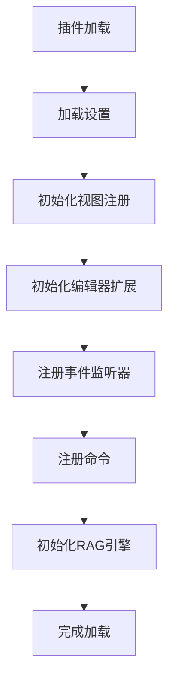
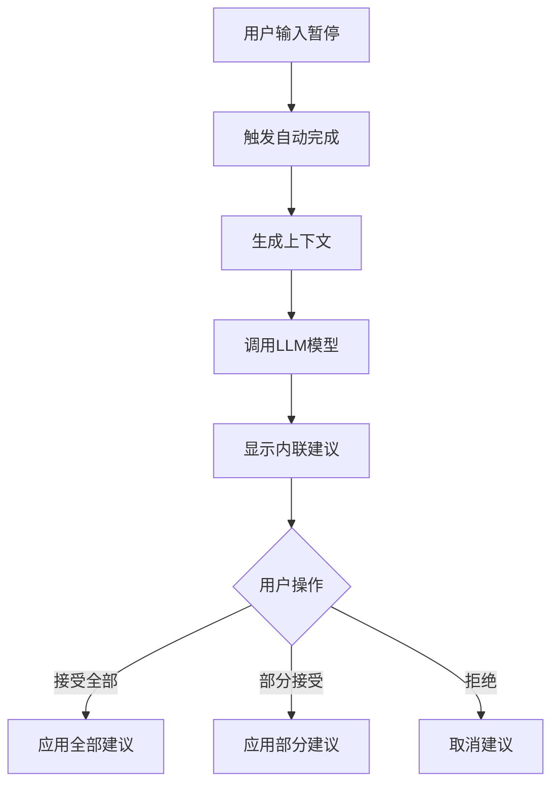
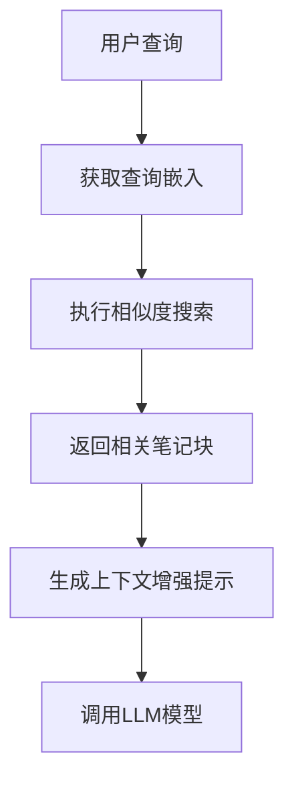
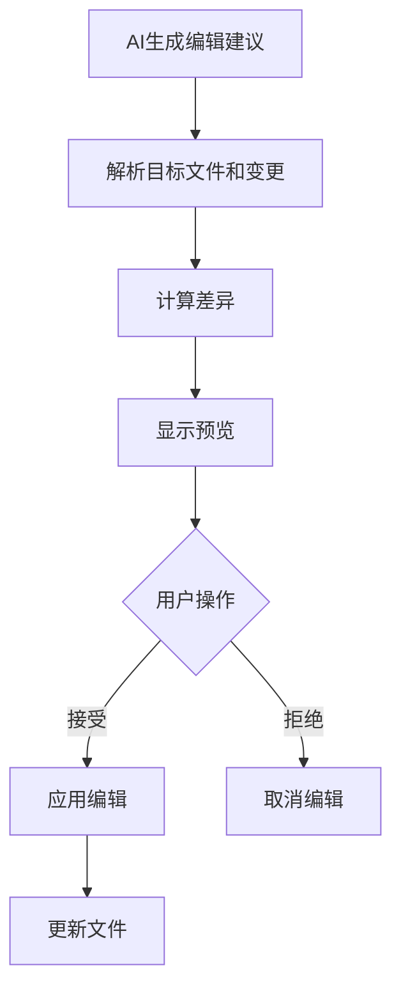
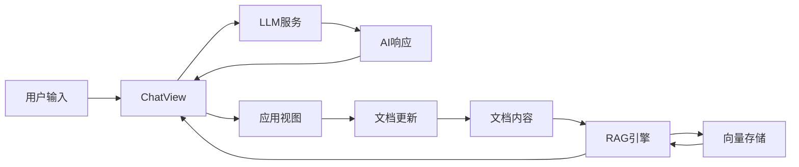
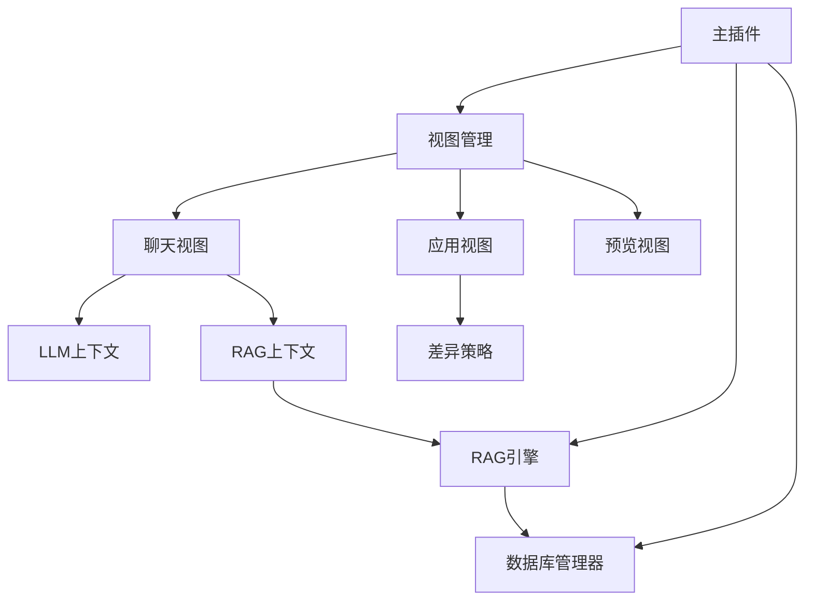

# Infio Copilot 架构概览

Infio Copilot 是一个基于AI的Obsidian插件，提供智能自动完成和与笔记交互式聊天功能。本文档概述了项目的主要功能模块和执行流程。

## 主要功能模块

### 1. 核心模块

- **主应用插件 (main.ts)** - 插件的入口点，管理生命周期、设置和视图注册
- **RAG引擎 (rag-engine.ts)** - 负责检索增强生成和向量搜索功能
- **内联编辑处理器 (inline-edit-processor)** - 处理AI建议的内联编辑
- **差异策略 (DiffStrategy)** - 管理文档更改和应用编辑的不同策略

### 2. 视图模块

- **聊天视图 (ChatView)** - 提供与AI助手交互的主界面
- **应用视图 (ApplyView)** - 管理应用AI生成编辑到文档的界面
- **预览视图 (PreviewView)** - 预览AI生成内容

### 3. UI组件

- **聊天界面组件** - 聊天历史、消息输入、模式选择等
- **建议渲染插件** - 显示和管理内联建议
- **状态栏** - 显示当前模式和状态信息

### 4. 数据管理

- **数据库管理器 (DBManager)** - 管理向量存储和聊天历史
- **向量管理器 (VectorManager)** - 管理文档嵌入和相似度搜索
- **设置管理** - 处理用户配置选项

### 5. 工具和工具链

- **文档变更监听器** - 监听编辑器事件和文档更改
- **命令注册** - 注册Obsidian命令
- **快捷键监听器** - 管理键盘快捷键交互

## 执行流程

### 1. 插件初始化流程



### 2. 聊天流程

```mermaid
flowchart TD
    A[用户输入消息] --> B{包含@提及?}
    B -->|是| C[解析提及内容]
    B -->|否| D[使用默认上下文]
    C --> E[生成AI提示]
    D --> E
    E --> F[调用LLM模型]
    F --> G[流式响应]
    G --> H[渲染回复]
    H --> I{需要应用编辑?}
    I -->|是| J[打开应用视图]
    I -->|否| K[对话继续]
```

### 3. 内联自动完成流程



### 4. RAG检索流程



### 5. 编辑应用流程



## 数据流



## 模块依赖关系



## 配置与扩展点

系统的主要配置点在设置选项卡中，包括：
- LLM提供商和API密钥配置
- RAG检索参数设置
- 自动完成行为设置
- 自定义模式和提示配置

扩展点包括：
- 自定义模式系统
- 自定义差异策略
- 多种LLM提供商支持 