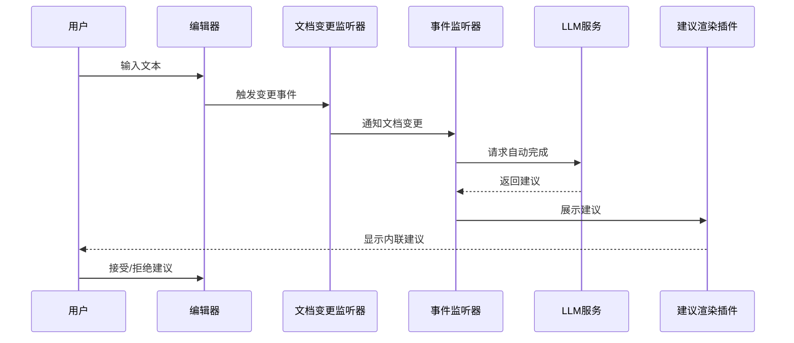
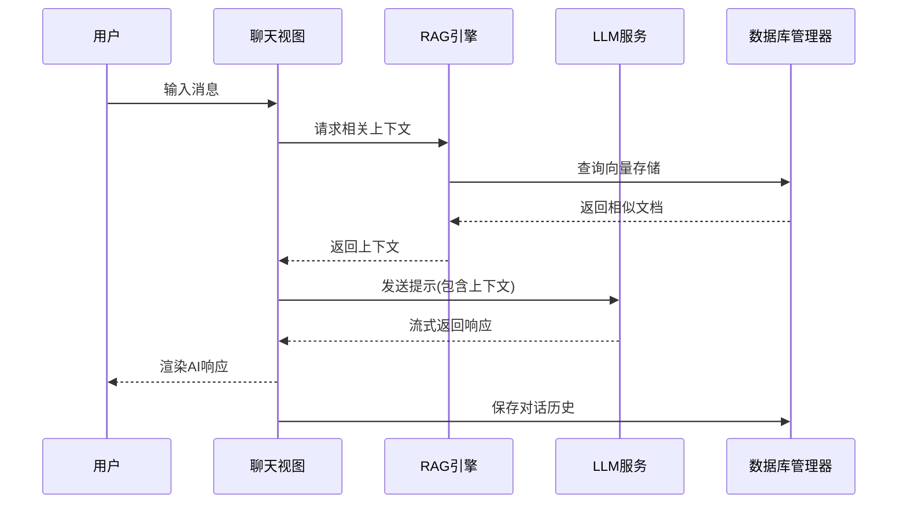
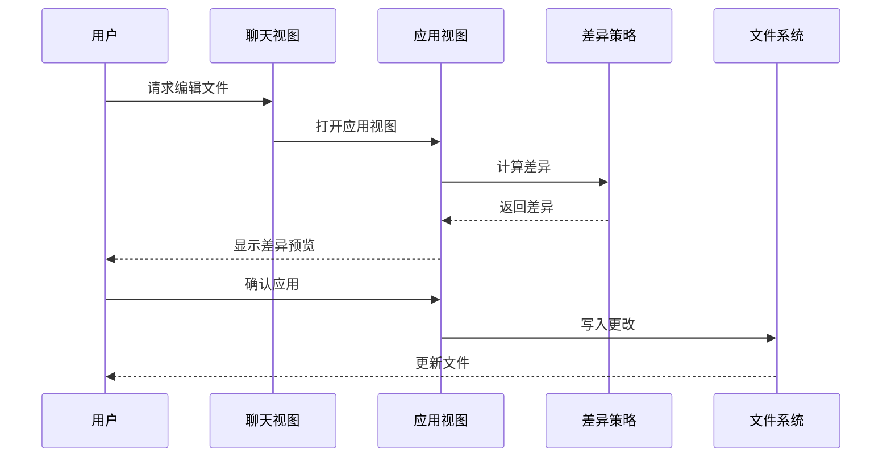
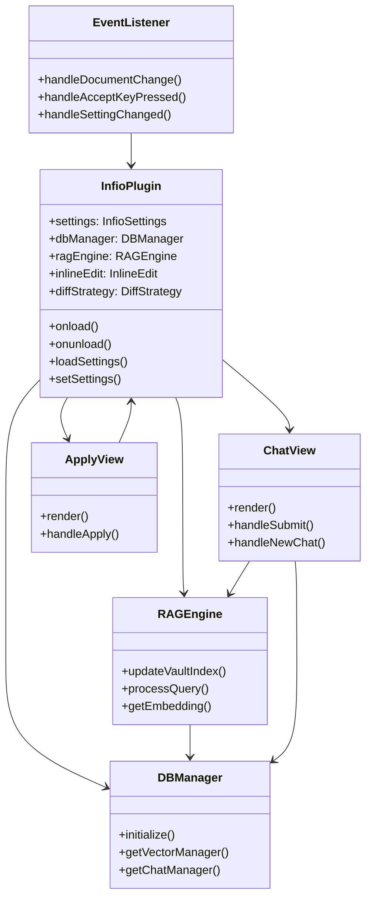

# Infio Copilot 组件详情

本文档详细介绍 Infio Copilot 的主要组件、它们的功能以及组件之间的交互。

## 核心组件

### 1. 主插件 (InfioPlugin)

`InfioPlugin` 是整个应用的入口点，在 `main.ts` 文件中定义，继承自 Obsidian 的 `Plugin` 类。

**主要职责：**
- 插件生命周期管理（加载、卸载）
- 设置管理
- 视图注册
- 命令注册
- 事件监听器注册
- 编辑器扩展配置

**重要方法：**
- `onload()`: 插件加载时执行的初始化操作
- `onunload()`: 插件卸载时执行的清理操作
- `loadSettings()`: 加载用户设置
- `setSettings()`: 更新用户设置
- `getDbManager()`: 获取或初始化数据库管理器
- `getRAGEngine()`: 获取或初始化RAG引擎

### 2. RAG引擎 (RAGEngine)

`RAGEngine` 提供检索增强生成功能，负责管理文档索引和相似性搜索。

**主要职责：**
- 维护文档向量索引
- 执行向量相似度搜索
- 处理查询嵌入
- 更新和删除文档索引

**重要方法：**
- `updateVaultIndex()`: 更新整个仓库的向量索引
- `updateFileIndex()`: 更新单个文件的向量索引
- `deleteFileIndex()`: 删除单个文件的索引
- `processQuery()`: 处理查询并返回相似文档
- `getEmbedding()`: 获取文本的嵌入向量

### 3. 内联编辑处理器 (InlineEdit)

处理和应用AI建议的内联编辑，允许在Markdown文档中使用代码块进行编辑标记。

**主要职责：**
- 解析infioedit代码块
- 应用编辑建议
- 渲染编辑预览

### 4. 差异策略 (DiffStrategy)

负责计算和应用文本差异，支持不同的差异计算算法。

**主要职责：**
- 计算原始文本和目标文本之间的差异
- 生成差异可视化展示
- 应用差异到原始文本

## 视图组件

### 1. 聊天视图 (ChatView)

`ChatView` 是用户与AI助手交互的主界面，在 `ChatView.tsx` 中定义。

**主要职责：**
- 渲染聊天界面
- 处理用户输入
- 显示AI响应
- 管理聊天历史
- 支持聊天模式切换

**重要方法：**
- `handleSubmit()`: 处理用户消息提交
- `handleNewChat()`: 创建新聊天
- `handleLoadConversation()`: 加载已有对话
- `handleApply()`: 应用AI建议的编辑

### 2. 应用视图 (ApplyView)

`ApplyView` 负责展示和应用AI生成的编辑建议。

**主要职责：**
- 显示文本差异
- 提供接受/拒绝编辑选项
- 应用编辑到目标文件

### 3. 预览视图 (PreviewView)

`PreviewView` 提供生成内容的预览功能。

**主要职责：**
- 显示生成内容的预览
- 支持预览格式化

## 数据管理组件

### 1. 数据库管理器 (DBManager)

管理插件的数据存储，包括聊天历史和向量数据。

**主要职责：**
- 初始化和管理数据库连接
- 提供数据访问接口
- 管理向量存储

**重要方法：**
- `initialize()`: 初始化数据库
- `getVectorManager()`: 获取向量管理器实例
- `getChatManager()`: 获取聊天管理器实例

### 2. 向量管理器 (VectorManager)

管理文档嵌入向量和相似度搜索功能。

**主要职责：**
- 创建和更新向量索引
- 执行相似度搜索
- 管理向量维度

**重要方法：**
- `updateVaultIndex()`: 更新全库索引
- `UpdateFileVectorIndex()`: 更新单个文件索引
- `DeleteFileVectorIndex()`: 删除文件索引
- `performSimilaritySearch()`: 执行相似度搜索

## UI交互组件

### 1. 事件监听器 (EventListener)

监听用户和编辑器事件，处理自动完成和键盘交互。

**主要职责：**
- 监听编辑器更改
- 处理自动完成触发
- 管理键盘快捷键响应

**重要方法：**
- `handleDocumentChange()`: 处理文档变更事件
- `handleAcceptKeyPressed()`: 处理接受建议快捷键
- `handleCancelKeyPressed()`: 处理取消建议快捷键
- `handleSettingChanged()`: 处理设置变更

### 2. 建议渲染插件 (RenderSuggestionPlugin)

渲染和管理内联建议界面。

**主要职责：**
- 在编辑器中显示建议内容
- 处理建议交互
- 管理建议状态

## 组件交互流程图

### 1. 自动完成流程中的组件交互

### 2. 聊天流程中的组件交互

### 3. 编辑应用流程中的组件交互

## 组件依赖关系

