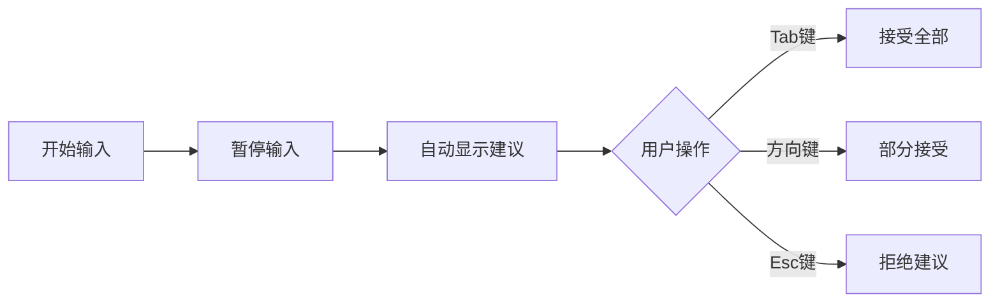

# Infio Copilot 用户指南

Infio Copilot 是一个功能强大的 Obsidian 插件，为您的笔记提供智能自动完成和交互式AI聊天功能。本指南将介绍插件的主要功能和使用方法。

## 功能概述

Infio Copilot 提供以下主要功能：

1. **智能自动完成** - 在编写笔记时自动提供续写建议
2. **交互式AI聊天** - 与您的笔记内容进行智能对话
3. **文档编辑辅助** - AI辅助的文档编辑和修改
4. **知识库检索** - 基于向量搜索的相关内容检索
5. **自定义模式** - 为特定任务定制AI助手行为

## 开始使用

### 安装插件

1. 在 Obsidian 中打开设置
2. 进入"第三方插件"选项卡
3. 点击"浏览"并搜索"Infio Copilot"
4. 点击"安装"并启用插件

### 配置插件

首次使用前，需要进行基本配置：

1. 在 Obsidian 设置中找到"Infio Copilot"选项卡
2. 选择您想要使用的 LLM 提供商（OpenAI、Anthropic、Ollama等）
3. 输入相应的 API 密钥
4. 根据需要调整其他设置选项

## 主要功能使用指南

### 1. 智能自动完成

自动完成功能可以在您编写笔记时提供智能续写建议：



**使用步骤：**
1. 开始在笔记中输入内容
2. 输入暂停后，系统会自动显示建议（灰色文本）
3. 按 `Tab` 键接受全部建议，按方向键接受部分建议，按 `Esc` 键拒绝建议

**快捷键：**
- `Tab` - 接受全部建议
- `→` - 接受下一个单词
- `Esc` - 拒绝建议

**自定义设置：**
- 在设置中可调整自动完成的延迟时间
- 可设置特定文件路径或文件类型启用/禁用自动完成
- 可调整自动完成触发的最小字符数

### 2. 交互式AI聊天

与您的笔记内容进行智能对话：

**启动聊天：**
- 点击侧边栏的魔杖图标
- 或使用命令面板 (`Ctrl+P`/`Cmd+P`) 并输入"Open New Chat"

**聊天功能：**
- 输入问题直接与AI对话
- 使用@符号引用特定笔记或选定内容
- 切换不同的对话模式（默认、创意、技术等）
- 查看和继续之前的对话

**引用内容：**
- `@current-file` - 引用当前打开的文件
- `@vault` - 引用整个知识库
- 选中内容后右键菜单 - "添加到Infio对话"

### 3. 文档编辑辅助

AI可以帮助您编辑和修改文档：

**请求编辑：**
1. 在聊天中描述您想要的编辑
2. AI会提供编辑建议
3. 点击"应用"按钮将更改应用到文档

**内联编辑标记：**
您可以在Markdown文档中使用特殊代码块请求AI编辑：

````markdown
```infioedit
指令: 修改下面的文本，使其更简洁
```
需要修改的文本内容...
````

### 4. 知识库检索

Infio Copilot 可以搜索您的笔记，提供相关内容：

**索引设置：**
- 在插件设置中配置索引选项
- 使用命令"重建索引"来创建或更新知识库索引

**检索使用：**
- 在聊天中引用 `@vault` 激活知识库检索
- 系统会自动查找与您问题相关的笔记内容
- 检索结果会作为上下文用于生成回答

**高级设置：**
- 可设置笔记块分块大小
- 可调整检索结果数量和相似度阈值
- 可设置包含/排除特定文件夹或文件

### 5. 自定义模式

为特定任务定制AI助手行为：

**预设模式：**
- 默认模式：通用对话
- 创意模式：生成创意内容
- 技术模式：提供技术建议
- 总结模式：概括文档内容

**创建自定义模式：**
1. 在设置中找到"自定义模式"选项卡
2. 点击"添加新模式"
3. 设置模式名称和描述
4. 定义系统提示（指导AI行为的指令）
5. 保存并在聊天界面使用您的自定义模式

## 高级功能

### 命令注册

Infio Copilot 注册了以下 Obsidian 命令：

- `open-new-chat`: 打开新的聊天窗口
- `add-selection-to-chat`: 将选中内容添加到聊天中
- `rebuild-vault-index`: 重新构建库索引
- `update-vault-index`: 更新库索引
- `autocomplete-accept`: 接受自动完成建议
- `autocomplete-partial-accept`: 部分接受自动完成建议
- `autocomplete-reject`: 拒绝自动完成建议

### 内联提示标记

除了常规对话外，您还可以使用特殊标记来指导AI：

- `/command` - 触发特定命令菜单
- `:::` - 在聊天中划分思考区域

## 故障排除

### 常见问题

1. **自动完成不工作**
   - 检查是否启用了自动完成功能
   - 确认当前文件类型未被排除
   - 验证API密钥是否正确设置

2. **知识库检索结果不准确**
   - 尝试重建索引
   - 调整相似度阈值
   - 检查是否有排除特定文件夹的设置

3. **API连接问题**
   - 确认网络连接
   - 验证API密钥是否有效
   - 检查API基础URL设置（如使用自定义模型）

### 日志和报告

如果遇到问题，可以：
1. 打开开发者控制台查看日志 (`Ctrl+Shift+I`/`Cmd+Opt+I`)
2. 在GitHub上提交问题报告
3. 在社区论坛寻求帮助

## 性能优化建议

为获得最佳体验，请考虑以下建议：

1. **知识库大小**
   - 对于大型库，考虑使用更具针对性的包含/排除模式
   - 增加块大小可减少索引数量，但可能降低检索精度

2. **自动完成响应性**
   - 减少自动完成延迟可提高响应速度，但可能增加API调用
   - 增加最小触发字符数可减少不必要的API调用

3. **内存使用**
   - 定期重建索引而非仅更新可以优化内存使用
   - 关闭不使用的聊天窗口以释放资源

## 隐私和安全

Infio Copilot 高度重视您的数据隐私：

- 所有API调用直接从您的设备发送到所选的AI服务提供商
- 笔记内容不会被存储在Infio服务器上
- 索引数据存储在本地Obsidian库内
- 可选择关闭云服务，仅使用本地模型（如Ollama） 